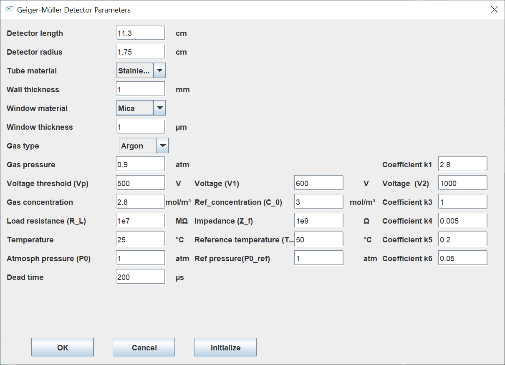

# SGMDA v1 (Simulation of Geiger Muller Detector and Attenuation)

**SGMDA v1** software is designed for the simulation and optimization of Geiger Müller detectors, allowing to improve their performance in the detection of gamma rays by varying several parameters. It also allows to study the attenuation of gamma rays through various materials.
SGMDA v1 offers several material plates to analyze the attenuation of gamma rays. These materials are chosen for their well-defined physical properties.
The software's graphical interface is simple and intuitive, allowing users to visualize in 3D the detector, the radiation source and the materials used.
This helps to better understand the simulations and to adjust the parameters as needed. The software is designed to be easy to use, even for beginners in simulation. This first version only includes gamma rays. The next version of the software will add other beta and alpha particles and also new options to enrich the analyses and improve the simulation of the detectors. A PDF guide, detailing the features of SGMDA, is available at [here](https://github.com/LAHCEN-EL-AMRI/SGMDA_v1/blob/main/doc/SGMDA%20Software%20Guide.pdf)

# GUI

#  window dedicated to the radioactive source parameter

#  Window dedicated to Geiger Müller detector parameters

#  Window dedicated to gamma ray absorption plates

# Prerequisites
A [manual](https://github.com/LAHCEN-EL-AMRI/SGMDA_v1/blob/main/doc/SGMDA%20Software%20Guide.pdf) existed in the Doc folder explains in detail all the options of the graphical interface.

# Installion

- Without installation: click directly on SGMDA.exe

# Dependencies:

This project requis the following dependencies :

- [java language version 21.0.4](https://www.oracle.com/java/technologies/javase/jdk21-archive-downloads.html)
- [JFreeChart library](https://www.jfree.org/jfreechart/)
- javafx-sdk-21.0.2

# Versions
- 1.0

# Authors
* **LAHCEN EL AMRI** *lahssenelamri@gmail.com*  *doctor* *Team of reactor physics, energy and nuclear safety, Faculty of Sciences, Mohammed V University of Rabat, Morocco
* **OMAR EL BOUNAGUI** *o.elbounagui@um5r.ac.ma* * professor* * LaMCSCI, Faculty of Sciences, Mohammed V University of Rabat, Morocco
* **HAMID AMSIL** *  amsil@cnesten.org.ma*  *expert doctor* * Nuclear Centre of Energy, Science and Nuclear Techniques, Morocco

# LICENSE
- This project is licensed under Creative Commons Attribution-NonCommercial 4.0 International (CC BY-NC 4.0) [License](https://github.com/LAHCEN-EL-AMRI/SGMDA_v1/blob/main/LICENSE)see the LICENSE.md file for more information)
